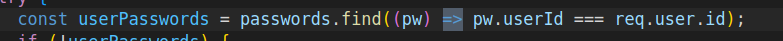

# passwortSafe

Author Fabian Bätscher & Jonathan Furrer & Jannis Beichler

Sicherheitsaspekte:

- Login:

  1. user schickt login daten and das Backend
  2. Backend hashed Passwort mit Sha-256 und zusätzlich mit MD-5.
  3. Backend überprüft Hash.
  4. Wenn login erfolgreich bekommt man ein Autentication token und ein normales token mit dem MD-5 Hash.
  5. User ist eingeloggt.

- Neues Passwort hinzufügen:

  1. User gibt daten für neues Passwort ein.
  2. Backend holt MD-5 Hash vom token.
  3. Verschlüsselt die Daten von dem User mit dem MD-5 hash als Key.
  4. Daten werden gespeichert.

- Passwort anzeigen:

  1. Überprüfen ob ein gültiges Autentificierungs token existiert.
  2. Id vom aktuellen User wird geholt.
  3. Alle Passwörter von der aktuellen user holen.
  4. MD-5 Hash von dem token holen
  5. Mit dem MD-5 Hash als key Passwörter entschlüsseln.
  6. Entschlüsselte Daten ans Frontend senden.

- Passwort Updaten:

  1. Id vom aktuellen Eintrag wird geholt.
  2. User gibt neue daten ein um das Passwort zu ändern.
  3. Backend holt MD-5 Hash vom token.
  4. Verschlüsselt die Daten von dem User mit dem MD-5 hash als Key.
  5. Daten werden gespeichert.

- Registrieren

  1. Registrierungs daten werden vom User ans backend gesendet und es wird überprüft ob das Passwort genug stark ist.
  2. User name wird überprüft ob er bereits existiert.
  3. Wenn er existiert, gibt es einen Fehler code zurück. Wenn nicht geht es mit dem nächsten Schritt weiter.
  4. neue Id wird dem User gegeben.
  5. Passwort wir mit SHA-256 gehashed.
  6. Id + UserName + Passwort wird in der Datenbank gespeichert.
  7. Mit dem Passwort wird ein MD-5 Hash erstellt.
  8. Wenn eingeloggt bekommt man ein Autentication token und ein normales token mit dem MD-5 Hash.
  9. User ist eingeloggt und neu registriert.

- Logout

  1.  Löschen alle tokens

Installation

- Backend: npm ci (für clean Installation)
- Frontend: npm ci (für clean installation)

- Docker:
  - Docker Desktop öffnen
  - auf den Ordner dc wechseln im Terminal "cd dc"
  - dort ls machen
  - nach docker-compose up suchen
  - im Terminal docker-compose up eingeben

Backend

- Wir haben 5 Endpoints: login, register, addNewPassword,
  getPasswords und updatePassword

  - login:
    Im Login fragen wir ab, ob die User daten stimmen. Wenn das nicht der Fall ist, wird eine Meldung ausgegeben, dass die User daten falsch sind. Im Falle das
     der User kann sich einloggen, weil das im Hintergrund gehashte Passwort mit dem gehashten Passwort in der Datenbank abgeglichen wurde und stimmt. Dann wird zum  
     Entschlüsseln der Passwörter des Users nochmals das eingegebene Passwort mit einem anderen hashing Prozess verschlüsselt. Dieser ist dann der Key zum Entschlüsseln seiner Passwörter. Beide gehashten Passwörter werden in tokens im Browser gespeichert.

  - register:
    Hier ist der einzige Unterschied, dass man diesen Endpoint nutzt, um sich als Neukunde einzuloggen. Danach wird man direkt eingeloggt und das Passwort wird zweimal gehasht und in Tokens gespeichert.

  - addNewPassword:
     Wenn man ein neues Passwort zu seinem Passwortmanager hinzufügen möchte, kann man diesen Endpoint nutzen. Das neue eingegebene Passwort wird direkt verschlüsselt,
    mit dem gehashten Passwort des Users. Welches das Master Password ist.

  - getPasswords:
    Dieser Endpoint gibt die entschlüsselten Passwörter des Users zurück, und zwar nur diese des Users.

  - updatePassword:
    Mit diesem Endpoint kann man eines seiner Passwörter in seinem Passwortmanager abändern. Sobald man das gemacht hat, wird es wieder verschlüsselt mit dem Master Passwort des Users.
  - logout:
    - In diesem Endpoint, wird der User augeloggt und die Tokens gelöscht

Frontend

- Login Page:

  - Auf dieser Seite hat es zwei Input-Felder für Username und Passwort. Dann kann man das mit einem Button, welches ein Submit hat, und abschicken ans Backend.

- Passwort Page

  - Hier werden alle Passwörter des Users angezeigt. Aber nicht ganz angezeigt. Sie werden noch durch ein Feld geschützt, welches anstatt des Passwortes 5 Punkte  
    anzeigt. Erst, wenn man den Button Show geklickt, wird das dazugehörige Passwort angezeigt.

- Register Page

  - Auf dieser Seite hat es zwei Input-Felder für Username und Passwort. Dann kann man das mit einem Button, welches ein Submit hat, und abschicken ans Backend. Man
    wird direkt eingeloggt und auf die Passwort Page weitergeleitet.

- Update Passwort Page
  - Hier kann man ein ausgewähltes Passwort updaten. Man wird danach direkt an die Passwort-Page weitergeleitet.

Relfexion:

- Jannis:
  Ich fand das Projekt eine gelungene Arbeit. Wir konnten selber planen, wie wir das Projekt aufbauen wollen und mit welcher Sprache wir es machen. Diese  
  Das Projekt hat die Teamarbeit gestärkt und uns gezeigt, wie man ein Passwort und diese Informationen am besten sichern kann. z. B.
  SQL Injektion, Schutz etc. Wir hätten uns bei der Planung etwas mehr Gedanken machen müssen, aber auch trotzdem haben wir durch Fleiss und effektives arbeiten unser Projekt noch fertig geschafft.

- Jonathan:
  Ich fand das Projekt sehr spannend auch wen ich erst später dazu kam. Ich habe trozdem sehr viel neuse gelernt auf welche dinge man alles achten muss um die Passwörter möglichst sicher speichern zu können und konnte auch nochmals mir node js etwas genauer anschauen. Zudem fand ich auch das wir uns sehr gut absprechen konnten wer für was zuständig ist.

- Fabian:
  Ich fand das Projekt sehr spannend und habe sehr viel über das Thema Verschlüsselung, hashing und Docker gelernt. Zudem habe ich auch gelernt, wie man ein Login sicher machen kann. Ich hatte am Anfang etwas Schwierigkeiten mit den CORS und bekam immer wieder Errors. Dies konnte ich aber gut lösen. Am Anfang des Projekts habe ich alles dockerisiert, um alles einfach starten zu können.


Funktionale Programmierung

  Pure functions
  - Eine pure function (reine Funktion) ist eine Funktion, deren Ausgabe nur von ihren Eingabewerten abhängt und die keine Seiteneffekte hat. Das bedeutet, dass sie keine Zustandsänderungen außerhalb ihrer eigenen Ausführung verursacht.

  In unserem Beispiel haben wir zwei Funktionen zur Verschlüsselung und Entschlüsselung implementiert:

  encryptValue: Verschlüsselt einen Klartext mithilfe von AES-256-CBC.
  

  decryptValue: Entschlüsselt einen verschlüsselten Text zurück in den Klartext.
  


  immutable values
  - Immutable Functions sind Funktionen, die die Daten, die sie erhalten, nicht ändern. 
    Stattdessen erzeugen sie neue   Datenstrukturen mit den gewünschten Änderungen.

    In unserem Beispiel zeigen wir, wie eine immutable Funktion genutzt werden kann, um ein Array zu filtern. Dabei wird das ursprüngliche Array nicht verändert. 

    Wir Slicen die liste von Passwörtern. Dort holen wir uns den ersten und letzten index. Dadurch kann man später dann sagen wie viel pro Seite angezeigt werden sollen.
    

  higher-order-functions
  - Higher-Order Functions sind Funktionen, die andere Funktionen als Argumente nehmen oder Funktionen zurückgeben. 
    Sie ermöglichen eine funktionale Programmierung, bei der Funktionen auf andere Funktionen angewendet werden können.

    Für unser Beispiel haben wir einen Post Endpoint funktion erstellt, welcher eine Funktion als Parameter erhält. Diese Funktion prüft ob man eingeloggt ist. Das Resultat wird an den Post Request weitergeleitet. Dieser Entscheidet ob man dann eingeloggt wird oder nicht.

    

    


  deklarative Programmierung
    - Deklarative Programmierung beschreibt was ein Programm tun soll, ohne die genauen Schritte zur Ausführung anzugeben. Dies führt
      zu lesbarerem und wartbarem Code. Paging in Webanwendungen ermöglicht das Anzeigen großer Datenmengen in übersichtlichen Portionen. Deklarative Programmierung vereinfacht die Implementierung und Wartung der Paging-Logik.
      ```js
      .slice()
      .map()
      .filter()
      ```
      - Backend Part
      
      - Frontend Part
      
      Aber hier fehlt natürlich noch einen Teil, aber der Kern ist diese paar Zeilen Code

Lambda-Ausdrücke
  - Lambda-Ausdrücke, auch bekannt als Pfeilfunktionen (Arrow Functions), sind eine kompakte Art, Funktionen in JavaScript
    zu schreiben.
  - Arrow Function:
    Wir haben diese Variante einer Funktion genutzt, weil es einfach zu lesen ist und sehr kompkat ist, wie oben schon beschrieben.
    


- .find()
  - Sucht in einem Array nach einem Element, das eine bestimmte Bedingung erfüllt, und gibt das erste gefundene Element zurück.
  - const result = array.find(callback(element[, index[, array]]));
- .map()
  - Erstellt ein neues Array, indem es eine Funktion auf jedes Element des ursprünglichen Arrays anwendet.
  - const newArray = array.map(callback(element[, index[, array]]));
- .sort()
  - Sortiert die Elemente eines Arrays in-place und gibt das Array zurück. Die Sortierreihenfolge kann durch eine Vergleichsfunktion definiert werden.
  - array.sort([compareFunction]);
- .filter()
  - Erstellt ein neues Array mit allen Elementen, die eine bestimmte Bedingung erfüllen.
  - const newArray = array.filter(callback(element[, index[, array]]));
- .slice()
  - Erstellt ein flaches neues Array mit einem Teil des ursprünglichen Arrays, beginnend bei einem bestimmten Index und bis zu (aber nicht einschließlich) einem anderen Index.
  - const newArray = array.slice([begin[, end]]);
- .findIndex()
  - Sucht in einem Array nach einem Element, das eine bestimmte Bedingung erfüllt, und gibt den Index des ersten gefundenen Elements zurück. Gibt -1 zurück, wenn kein Element gefunden wird.
  - const index = array.findIndex(callback(element[, index[, array]]));

Diese Methoden sind äußerst nützlich bei der Arbeit mit Arrays in React, insbesondere bei der Verwaltung und Darstellung von Zustandsdaten, welche wir brauchten, weil wir alle unsere Daten in Array und listen ausgeben.

Reflexion:

Jannis: Ich fand diesen Teil des projekts sehr spannend.Iich lernte neue Sache, wie zb das Pagin und noch vieles weiteres über React/  Express. Auch in diesem Projekt machte die Arbeit mit Fabian und Jonathan sehr spass. SIe haben beide gut gearbeitet und sich für das Projekt eingesetzt. Dieses Projekt hat sehr spass gemacht und ich fand es einen guten Weg, um zu lernen.

Jonathan: Dieser part der Projekt arbeit hat auch sehr viel spass gemacht da ich einiges noch lernen konnte. Ich hatte zuvor mühe richtig zu verstehen wie higher-order-functions funktionieren allerdings war es dan relativ einfach zu verstehen für was man dies braucht und wie es funktioniert alls ich es praktisch anwenden konnte. Die zusammenarbeit mit Fabian und Jannis lief auch sehr gut.

Fabian: In diesem Teil des Projekts konnte ich viel über die deklarative Programmierung lernen. Es hat mich sehr weiter gebracht, da ich mit einigen Problemen kämpfen musste. Wir konnten in unserer Gruppe die Aufgaben gut auf unsere Stärken aufteilen, um möglichst effizient die Aufgaben zu erledigen.